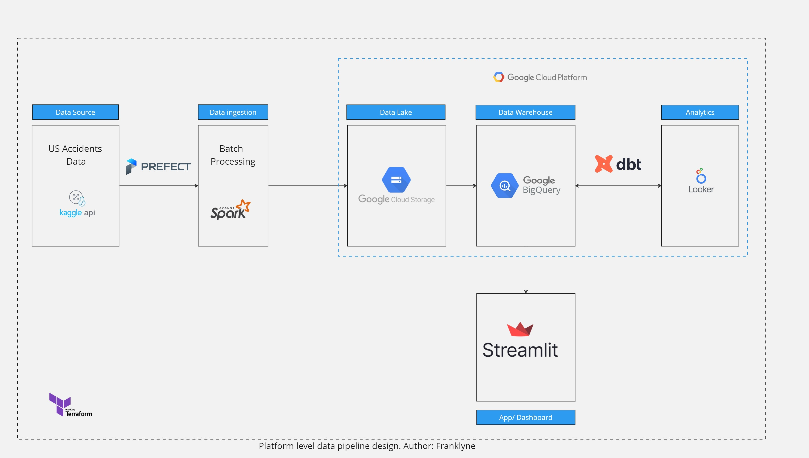
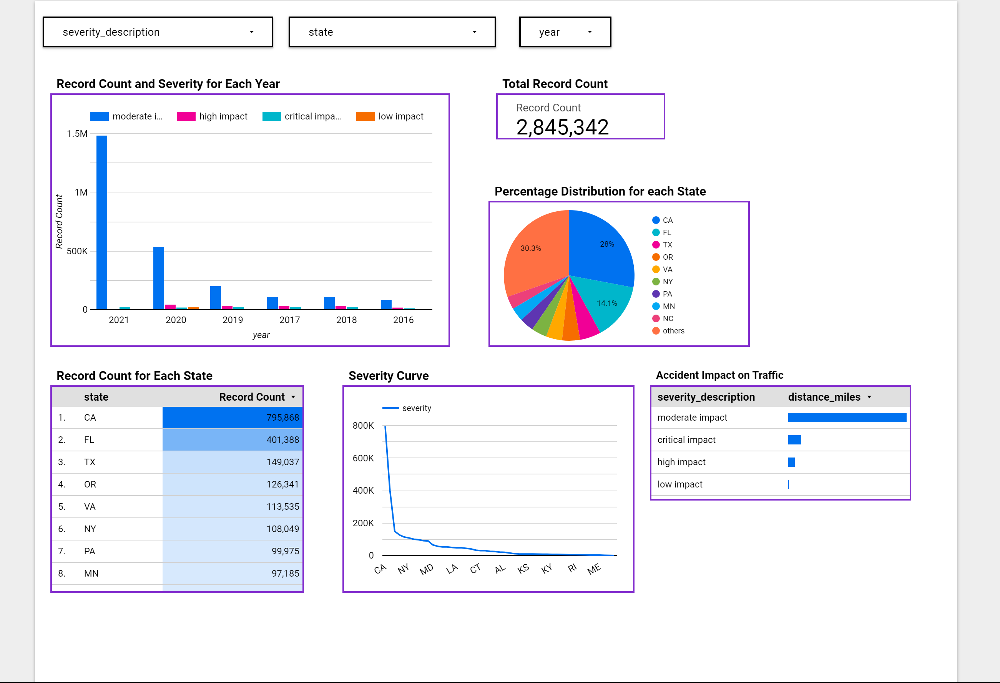

# US-Accidents: A Countrywide Traffic Accident Dataset

## Table of Contents

- [US-Accidents: A Countrywide Traffic Accident Dataset](#us-accidents-a-countrywide-traffic-accident-dataset)
  - [Table of Contents](#table-of-contents)
  - [Overview](#overview)
  - [Project Description](#project-description)
  - [Purpose](#purpose)
  - [Dataset Details](#dataset-details)
  - [Potential Use Cases](#potential-use-cases)
  - [Technologies](#technologies)
  - [Architecture](#architecture)
  - [ETL Pipeline](#etl-pipeline)
  - [DataWarehouse](#datawarehouse)
  - [Data building using DBT Cloud](#data-building-using-dbt-cloud)
  - [Dashboard](#dashboard)
  - [Setup](#setup)
  - [Running the Project](#running-the-project)
  - [Acknowledgements](#acknowledgements)

## Overview

The US-Accidents: A Countrywide Traffic Accident Dataset is a comprehensive dataset that contains detailed information about traffic accidents that occurred in the United States from February 2016 to December 2021. The dataset was compiled by ZenDrive, a data analytics firm, using a variety of sources such as traffic cameras, traffic sensors, and user reports from mobile apps.

---

## Project Description

- The aim of this project, is to perform Extract, Transform, Load, on US-Accidents dataset, to answer questions such as :

  - Identifying high-risk areas for traffic accidents and developing targeted interventions to improve safety.
  - Analyzing the impact of weather conditions on traffic accidents.
  - Studying accident hotspot locations

---

## Purpose

The purpose of this project is to provide a large and comprehensive dataset for researchers and practitioners in fields such as transportation engineering, public safety, and data science to analyze traffic accident patterns and develop strategies for reducing the number and severity of accidents on US roads.

---

## Dataset Details

The dataset contains over 2.8 million records, making it one of the largest publicly available traffic accident datasets. Each record includes information such as the location of the accident, the severity of the accident, the weather conditions at the time of the accident, and more. The dataset is hosted on Kaggle, a popular platform for hosting and sharing data science projects, and can be downloaded for free.

---

## Potential Use Cases

Some potential use cases for the US-Accidents: A Countrywide Traffic Accident Dataset include:

- Developing machine learning models to predict the severity of traffic accidents based on various factors.
- Studying the effectiveness of traffic safety policies and interventions.
- Studying the impact of precipitation or other environmental stimuli on accident occurrence.
- Real-time accident prediction.
  
Overall, the US-Accidents: A Countrywide Traffic Accident Dataset is a valuable resource for anyone interested in understanding and improving traffic safety in the United States.

---

## Technologies

This project utilizes the following technologies and tools:

- Google Cloud Platform
  - Google Storage buckets as Data Lake
  - Google Bigquery datasets as Data Warehouse
  - Google Looker Studio reports for Data Visualization
  - Google Compute Engine, if you use a VM on Google's Cloud Platform
- Terraform as Infrastructure as Code, to deploy Buckets and Datasets on Google Cloud Platform
- Python script is used to develop our pipeline from extraction to data ingestion
- Prefect as the orchestration tool
- Apache Spark and Pyspark for  transformation and processing the data in batches.
- Parquet columnar data files
- dbt for some data quality testing, data modelling and transformation, and promotion of data to Production BigQuery dataset

---

## Architecture

The technical architecture for this project is as show below:

1) Terraform is used to deploy Buckets and Datasets on Google Cloud Platform.

2) Data Extraction is done using Kaggle API.

3) Run the ETL pipeline, scheduled using Prefect. Data processing is done using Spark and Data is finally ingested into Google Cloud Storage and Google BigQuery.

4) Data building is done using Data Building Tool (dbt).

---

## ETL Pipeline

The ETL process is scheduled using Prefect framework.

The process involves the following steps :

- Extracting the data using Kaggle API
- Create a Spark Session
- Creating Schema for the data set
- Transform and Process the data using Spark
- Ingesting the data into data lake in batches
- Uploading the data to big query dataset.

More details on how to orchestrate the process. Go to [workflow.md](./workflow/workflow.md).

---

## DataWarehouse

The project dataWarehouse used is google bigquery. Visit [datawarehouse.md](./data_warehouse/datawarehouse.md) for detailed information.

---

## Data building using DBT Cloud

- dbt cloud is used in this project to build and transform data
- Visit [dbt_accidents](./dbt_accidents/README.md) for detailed information on how to run dbt project.

---

## Dashboard

Looker studio dashboard:

The link to lookerstudio dashboard showing the analytics of US Accidents countrywide Traffic Accident Dataset. Visit [dashboard](https://lookerstudio.google.com/reporting/6024d9e4-f49e-42ea-949f-2fc0f67cad39) for more information.

---

## Setup

- Follow instructions in [setup](./setup/) folder to setup the project environment.
- run `setup.sh` to setup up a development environment for working with Google Cloud Platform, Anaconda, Terraform, Java, Spark, and Pyspark.

## Running the Project

1) cd to [terraform](./terraform/) run the commands below.
   - `terraform init`
   - `terraform plan`
   - `terraform apply`
2) cd to [workflow](./workflow/) and run this command to run the ETL pipeline.
   - `prefect orion start`
   - `python pyspark/spark.sh`

   More details on how to configure prefect and create deployments in [workflow.md](./workflow/workflow.md)
  
3) For BigQuery Datawarehouse run the [biq_query.sql](./data_warehouse/big_query.sql) to create tables in the datawarehouse and perform more advanced queries. Detailed information in [datawarehouse.md](data_warehouse/datawarehouse.md) .

4) To build and transform data using dbt visit [dbt_accidents](./dbt_accidents/) folder for detailed information on how to run dbt models.

---

## Acknowledgements

Many thanks to:

- DataTalks.Club - for the opportunity to learn more about data engineering 👏.
- SOBHAN MOOSAVI - for providing me with the dataset I extracted from Kaggle and used 👏.
