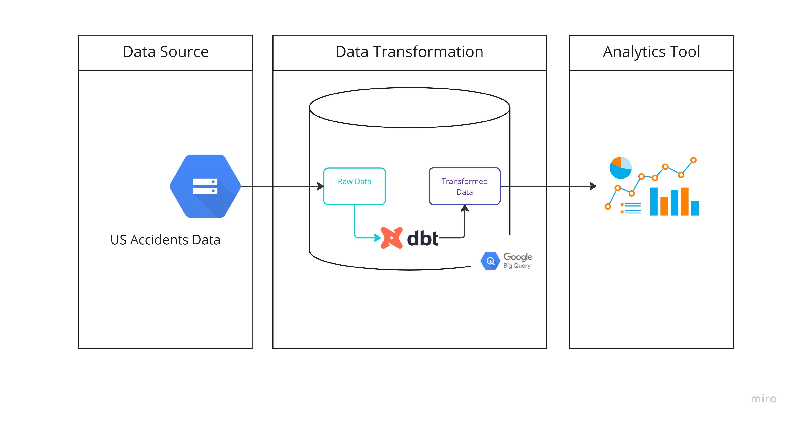

## How to run this project

### About the project

Start the project by running `$ dbt init`)

Create a branch and checkout the branch to be able to read/write the project.

Try running the following commands:

- `dbt run`
- `dbt test`

A project includes the following files:

- dbt_project.yml: file used to configure the dbt project. If you are using dbt locally, make sure the profile here matches the one setup during installation in ~/.dbt/profiles.yml
- *.yml files under folders models, data, macros: documentation files
- csv files in the data folder: these will be our sources, files described above
- Files inside folder models: The sql files contain the scripts to run our models, this will cover staging and core models At the end, these models will follow this structure:

### Workflow

### Execution

We are runnning the project in dbt cloud:

1) Create a Production Environment and configure it accordingly.

2) Create and Execute job the will run dbt models.

3) The dbt job will execute commands `$ dbt run` and `$ dbt test` is used to run dbt models and output the results to bigquery.

4) View the documentation for the project, after the job is completed successfully in the cloud.

5) The output of our models is stored in bigquery dataset.